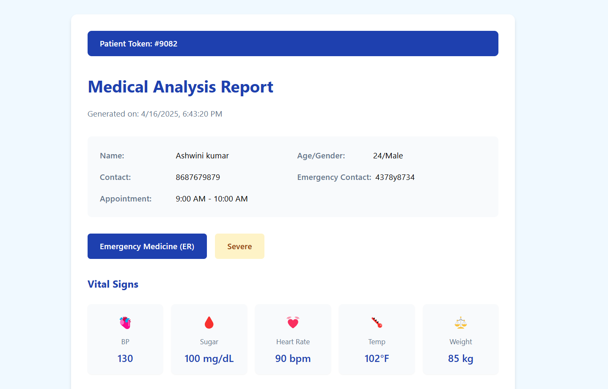

# My App

This project is a React-based web application designed for patient registration and medical analysis. It features a multi-step form for collecting patient data, integration with an AI-based analysis service, and a responsive design.

## Features
- Multi-step patient registration form with validation.
- AI-based medical analysis using the Ollama service.
- Real-time vitals and symptoms display.
- Responsive design with a modern UI.
- Integration with Tailwind CSS for styling.

## File Structure
- **src/components**: Contains reusable React components like `OllamaStatusButton` and `LoadingSpinner`.
- **src/pages**: Contains page-level components like `PatientForm`, `LoginPage`, and `Dashboard`.
- **src/styles**: Contains CSS files for styling the application.
- **src/utils**: Contains utility functions like `ollamaService.js` for API integration.

## How to Run
1. Clone the repository.
2. Navigate to the `my-app` directory.
3. Install dependencies using `npm install`.
4. Start the development server using `npm start`.
5. Open [http://localhost:3000](http://localhost:3000) in your browser.

## Dependencies
- React
- Axios
- Tailwind CSS
- Ollama API (for AI-based analysis)

## Preview
The application provides a clean interface for patient registration and medical analysis, with real-time feedback and AI-powered insights.

## Source Code
[GitHub Repository](https://github.com/Ashwini-169/my-app)

## Live Demo
[Live Demo](https://ashwini-169.github.io/my-app)
